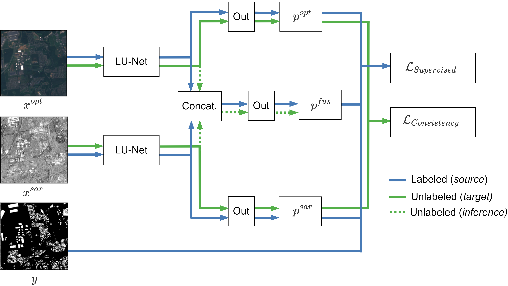

# Unsupervised domain adaptation for global urban extraction using Sentinel-1 SAR and Sentinel-2 MSI data 


This repository contains the official code for the following Paper:

Hafner, S., Ban, Y. and Nascetti, A., 2022. Unsupervised domain adaptation for global urban extraction using Sentinel-1 SAR and Sentinel-2 MSI data. Remote Sensing of Environment, 280, p.113192.

[[Paper](https://doi.org/10.1016/j.rse.2022.113192)] 



# Setup

Models were trained with Ubuntu 18.04.6 LTS, Python 3.9.7, PyTorch 1.10.0, and CUDA 11.4.

The main packages are listed below:

```
torch 0.10.0
torchvision 0.11.1
rasterio 1.2.10
```

To install the `rasterio` package on Windows, consider using the [Unofficial Windows Binaries for Python Extension Packages](https://www.lfd.uci.edu/~gohlke/pythonlibs/#gdal).


# Generating built-up area maps

In order to extraction urban areas for any region of interest, follow this simple 3-step process:

## 1 Data download

The Sentinel-1 SAR and Sentinel-2 MSI data is downloaded from [Google Earth Engine](https://earthengine.google.com/) (GEE). Use the following script as a template and replace parameters with those of your region of interest (detailed instructions are provided in the script).


After having run the script (and submitting the tasks in the `Task` panel), the Sentinel-1 and Sentinel-2 data will be in the Google Drive folders `urban_extraction_sentinel1_*roi*` and `urban_extraction_sentinel2_*roi*`, respectively.

Download the folders, rename them according to the sensor (i.e., `sentinel1` and `sentinel2`), and place them in a folder named after your region of interest:
```
$ Satellite data directory
*data_dir*
└── *roi* # this folder can also be placed in your dataset directory as an additional site
    ├── sentinel1
    ├── sentinel1
    └── samples.json # this file will be added when running inference.py (step 3)
```

## 2 Download the pre-trained model

Download the pre-trained model and place it in the `networks` folder.

Pre-trained models can be downloaded from the following link: [`here`](https://www.dropbox.com/sh/0m8t6dq37f11ukx/AAAgTgIxr_eyJJeHWqZ_SRVYa?dl=0). We strongly recommend using the proposed `fusionda` model.

Your networks folder should now contain the network file. Additionally, set up an inference folder:
```
$ Output data directory
output
├── networks
|    └── fusionda_checkpoint15.pt
└── inference
```
## 3 Run inference

Finally, run the `inference.py` file with the following arguments:
```
python inference.py -c fusionda -s *roi* -o *path to output directory* -d *path to data dir*
```

## 4 Stitching together the satellite patches (optional)


# Training from scratch

If you want to train your own networks from scratch, follow these steps:

## 1 Dataset download


The SEN12 Global Urban Mapping (SEN12_GUM) dataset can be downloaded from Zenodo.

[](https://doi.org/10.5281/zenodo.6914898)

## 2 Network training

To train your network with our unsupervised domain adaptation approach, run the ``train_dualnetwork.py`` with the ``fusionda.yaml`` config file:

````
python train_dualnetwork.py -c fusionda -o 'path to output directory' -d 'path to GM12_GUM dataset'
````

Likewise, the baselines can be replicated by running ``train_network.py`` with the configs ``sar.yaml``, ``optical.yaml`` and ``fusion.yaml``.


## 3 Model evaluation and inference


Run the files ``testing_quantitative.py`` and ``testing_qualitative.py`` with a config of choice and the path settings from above to assess network performance. For inference, use the file ``testing_inference.py`` instead.


## 4 Adding unlabeled data for further domain adaptation (optional)


# Credits

If you find this work useful, please consider citing:


  ```bibtex
    @article{hafner2022unsupervised,
      title={Unsupervised domain adaptation for global urban extraction using Sentinel-1 SAR and Sentinel-2 MSI data},
      author={Hafner, Sebastian and Ban, Yifang and Nascetti, Andrea},
      journal={Remote Sensing of Environment},
      volume={280},
      pages={113192},
      year={2022},
      publisher={Elsevier}
    }
  ```
  